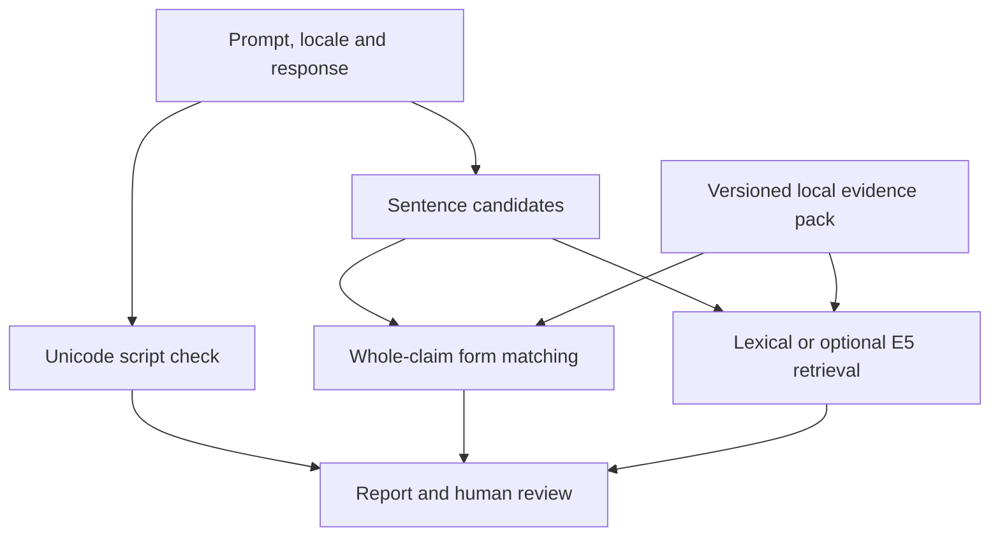

# BhashaGuard Edge

**An offline review prototype for Indian-language AI responses, with a Snapdragon deployment plan.**

BhashaGuard checks Telugu, Tamil and Kannada script fidelity, compares sentence candidates with a local evidence pack, and explains which claims are supported, contradicted or unresolved **within that pack**. The first intended use is a teacher reviewing a Telugu learning note before sharing it.

This repository accompanies the Snapdragon AI Lab Build & Present Challenge 2026 proposal. It does not claim Qualcomm/HP endorsement or selection.

## Current status

This is a working **CPU baseline**, not a completed Snapdragon NPU application. The bundled examples are invented software fixtures. They are not a real cultural knowledge base or a research benchmark. The original research dataset was not supplied and is not included.

| Capability | Status |
|---|---|
| Local browser UI, JSON/HTML report export | Implemented |
| Unicode script checks for Telugu, Tamil, Kannada | Implemented using `regex` Unicode properties |
| Exact whole-claim evidence matching and abstention | Implemented |
| Language/locale evidence filtering and provenance | Implemented |
| Lexical retrieval baseline | Implemented |
| Local E5 embeddings | Optional adapter implemented; real weights not tested in this build |
| Generation through a local OpenAI-compatible server | Optional loopback adapter implemented; no LLM weights bundled |
| General semantic entailment / cultural truth detection | Not implemented |
| Snapdragon QNN / Hexagon NPU inference | Planned, not measured |
| Native-speaker benchmark accuracy | Not measured |

## Quick start

Python 3.10 or newer is required. The initial dependency installation needs internet access. The default application then runs without internet or model downloads.

### Windows PowerShell

```powershell
py -m venv .venv
.\.venv\Scripts\python.exe -m pip install .
.\.venv\Scripts\python.exe -m bhashaguard serve
```

### Linux / macOS

```bash
python3 -m venv .venv
.venv/bin/python -m pip install .
.venv/bin/python -m bhashaguard serve
```

Open **http://127.0.0.1:8765**. Select a labelled fixture, then click **Analyse response**. Stop the server with Ctrl+C. The UI loads its assets locally. Drafts stay in memory unless the reviewer exports a report.

If `regex` does not have a wheel for your Python/platform combination, pip may need a compiler. Windows ARM64 installation and target-device performance still require validation. Do not describe an x64-emulated process as native ARM64 execution.

## A short demonstration

1. Load the Telugu supported fixture and inspect its source and English gloss.
2. Load the contradiction fixture. The exact curated contradiction receives a flag.
3. Load the unresolved fixture. Missing evidence produces abstention.
4. Load a supported fixture, append ` AI`, and rerun to show script mismatch.
5. Change the locale to `another:locale` to show scope mismatch.
6. Export the report. Inspect the CPU backend, evidence-pack hash and measured analysis time.

The fixture describes an invented village festival lasting three days. Its four-day form is a deliberate contradiction. This is a controlled test, not a statement about an actual tradition. The bundled valid-variant forms are paraphrase fixtures, not validated real regional variants.

## How the baseline makes a decision



Only an exact, normalized **whole-sentence** match to a curated form earns a support/contradiction label. Normalization uses NFC, case-folding, whitespace normalization and terminal punctuation removal. It does not remove negation or numbers. A partly matching sentence remains unresolved. Retrieved passages cannot independently earn a factual verdict. Conflicting labels also remain unresolved.

This conservative design has low recall for novel wording. It is a runnable starting point for evaluating a future grounded local-model verifier. It does not yet provide arbitrary prompt entailment, trained factual claim extraction, language identification or general cultural reasoning.

## Metrics

Let `s` include supported and valid-variant claims, `c` contradicted claims and `u` unresolved claims.

- Script fidelity = target-script alphabetic code points / assessed alphabetic code points. Optional Latin exclusion is explicit and counted. Zero denominators return `null` (UI: N/A).
- Evidence consistency = `s / (s + c)`.
- Evidence coverage = `(s + c) / (s + c + u)`.
- Optional E5 distance = `(1 - best retrieved-passage cosine) / 2`. This measures passage distance, not entailment. It differs from the reviewed-reference-answer metric proposed for a later study.
- Risk is categorical: `review_required`, `unresolved` or `no_flag_in_pack`. There is no invented risk probability.

The default lexical cosine score is **not** a semantic drift score. Reports keep `semantic_distance` null unless the E5 adapter is enabled. No flag means only that this limited pack/checker found none.

## CLI and tests

Run commands inside the virtual environment, or substitute its full Python path as above.

```bash
python -m unittest discover -s tests -v
python -m bhashaguard analyze --text-file docs/example-response-te.txt --language te --locale fictional:vennela
python -m bhashaguard benchmark --runs 30 --output benchmark.json
```

The benchmark measures warm whole-analysis latency on synthetic fixtures. It excludes application startup and model loading. It does not measure cultural accuracy, power, peak memory or NPU speedup. See [validation](docs/VALIDATION.md) for this build's actual results and remaining checks.

## Supplying evidence

Copy `bhashaguard/data/demo_pack.json`, replace the invented data with properly licensed, reviewed material, and follow [the pack specification](docs/EVIDENCE_PACK.md). Then run:

```bash
python -m bhashaguard --pack path/to/reviewed-pack.json serve
```

Each entry needs source provenance, an excerpt, language and locale, a review date and reviewer, and curated whole-claim forms. Pack metadata is an assertion by its author; the software cannot certify reviewer expertise or source truth. Do not mix private research data into a public repository.

## Optional local models

For multilingual E5 small, first download a complete model snapshot separately from [its publisher](https://huggingface.co/intfloat/multilingual-e5-small) and review its licence. Keep it outside the repository, under `models/` or another local directory.

```bash
python -m pip install ".[embeddings]"
python -m bhashaguard --embedding-model models/multilingual-e5-small serve
```

The adapter uses `local_files_only=True`, CPU execution, normalized embeddings and the E5 `query:`/`passage:` prefixes. It does not silently download weights. The optional dependency range is not a hardware-certified lockfile.

To use an already running local OpenAI-compatible generation server:

```bash
python -m bhashaguard serve --llm-endpoint http://127.0.0.1:8080/v1/chat/completions --llm-model local-model
```

Replace the model name with the name configured in your server. BhashaGuard does not launch that server. Only loopback IP endpoints are accepted, redirects and proxy inheritance are disabled, and the configured server's device is explicitly **unverified**. A local server can have its own telemetry/network behaviour; configure and audit it separately. Generate a response, then run the guard. The model does not override evidence labels.

## Snapdragon path

The intended deployment target is a Snapdragon-powered HP PC running Windows ARM64. The next step is to validate a matching Qualcomm Qwen bundle and/or export E5 to ONNX for a QNN experiment. The CPU implementation stays useful as a baseline for quality comparisons.

See [SNAPDRAGON.md](docs/SNAPDRAGON.md) for the model mapping, official documentation, hardware compatibility gates and measurement plan. No `npu_used=true` path exists in this release.

## Submission materials

- [Project proposal PDF](docs/submission/BhashaGuard_Edge_Final_Submission.pdf)
- [Short pitch PDF](docs/submission/BhashaGuard_Edge_Final_Pitch.pdf)
- [Editable short pitch PPTX](docs/submission/BhashaGuard_Edge_Final_Pitch.pptx)

The proposal and slides describe the wider intended system. This README describes what this repository actually implements. The screenshot of the submission form requires a GitHub URL separately from these files. Use the URL of this repository once it has been published and check that judges can access it.

## Privacy, scope and rights

The server binds to loopback, rejects cross-origin analysis requests and requires a per-session request token. Reports include the user's text and must be shared deliberately. This lightweight server is for a local demo, not a hardened multi-user or internet-facing service.

No model weights, personal data or native-speaker research dataset are included. See [RIGHTS.md](RIGHTS.md). The owner has not selected an open-source licence for this project. Third-party dependencies retain their own licences.

## Source documentation

- [Unicode Script and Script_Extensions](https://unicode.org/reports/tr24/)
- [Python regex package and Unicode property syntax](https://pypi.org/project/regex/)
- [Sentence Transformers local model loading](https://www.sbert.net/docs/package_reference/sentence_transformer/model.html)
- [Multilingual E5 small model card](https://huggingface.co/intfloat/multilingual-e5-small)
- [Prior Indian-language hallucination research: BHRAM-IL](https://aclanthology.org/2025.bhasha-1.9/)

The proposed contribution is a Dravidian-language evidence-review workflow and its future device evaluation. Multilingual hallucination detection itself is prior work.
